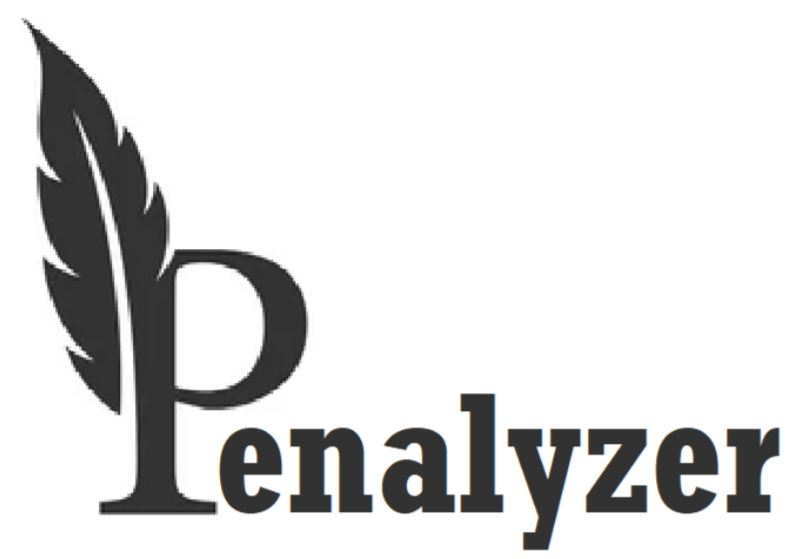
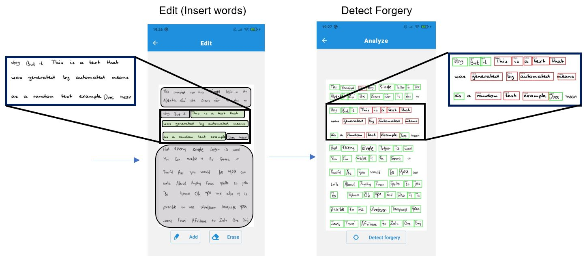

  

  

Penalyzer is a deep learning-based handwriting text editor, generator, and analyzer. By this tool, the following functionalities are available on handwritten documents:

* Addition/Deletion of handwriting within a given document.

* Writer Identification/Validation using a given document's calligraphic style.

* Handwriting Authentication / Handwriting Deepfake Detection.

A brief about the directories and files in this repo:

* **App** --> The Penalyzer React Native / Flask application.

* **Notebooks** --> .ipynp notebooks that contain the models' training and evaluating procedures.

* **WriterIdentification** --> The Writer Identification subsystem implementation, including all of the models and experiments.

* **Project_Final_Report.pdf** --> The final report of this project, including all relevant information, feels free to read and discuss (mail is attached below).

## Requirements

* Python3.
* Pytorch + torchvision.
* OpenCV.
* Numpy.
* Matplotlib.
* scikit-image.
* Scipy.
* Logging.
* Flask.
* React + React Native + hooks.
* Expo (for running the client-side on phone/emulator).
* PyCharm Community Edition with Anaconda (Recommended).

## Installation

* **Option 1:**
Please install the requirements.txt file in LINK using pip and other non-python requirements presented above.

* **Option 2:**
Please install the dependencies using Anaconda PyCharm (recommended).

## Models and Datasets

* The pretrained models are not given in this repository.

* The training processes were made on a few datasets:

  * The IAM handwritten words dataset.

  * Our handwritten real-fake words dataset.

  * A small set of our authentic words set.

  In order to get the pretrained models / datasets, please send us an email: eylon.miz@gmail.com

## Usage

Run the _main_.py file using PyCharm or another environment.

## Credits

* [Kang, Lei, et al. "GANwriting: Content-conditioned generation of styled handwritten word images", European Conference on Computer Vision. Springer, Cham, 2020.](https://arxiv.org/abs/2003.02567)

* [Davis, Brian, et al. "Text and Style Conditioned GAN for Generation of Offline Handwriting Lines", arXiv preprint arXiv:2009.00678, 2020.](https://arxiv.org/abs/2009.00678)

* [He, Sheng, and Lambert Schomaker. "Fragnet: Writer identification using deep fragment networks", IEEE Transactions on Information Forensics and Security 15: 3013- 3022, 2020.](https://arxiv.org/abs/2003.07212)

* [Dey, Sounak, et al. "Signet: Convolutional siamese network for writer independent offline signature verification", arXiv preprint arXiv:1707.02131, 2017.](https://arxiv.org/abs/1707.02131)

* [Frank, Joel, et al. "Leveraging frequency analysis for deep fake image recognition", International Conference on Machine Learning. PMLR, 2020.](https://arxiv.org/abs/2003.08685)

* [Microsoft OCR Cognitive Service](https://docs.microsoft.com/en-us/azure/cognitive-services/computer-vision/overview-ocr)

* [IAM Handwriting Dataset](https://fki.tic.heia-fr.ch/databases/iam-handwriting-database)
